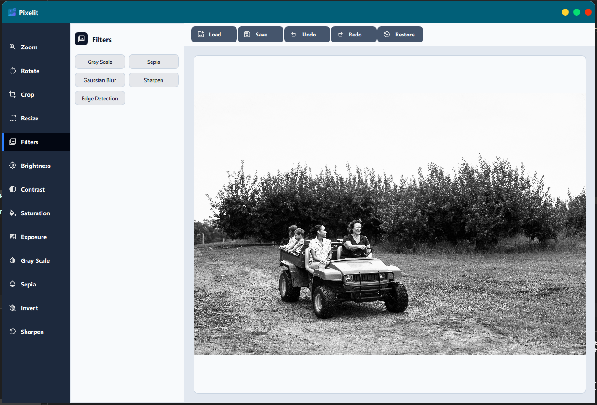
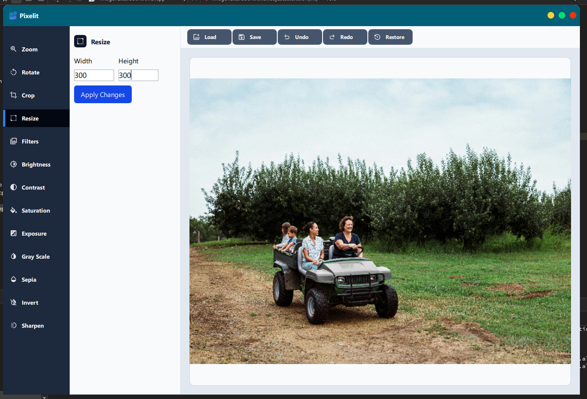
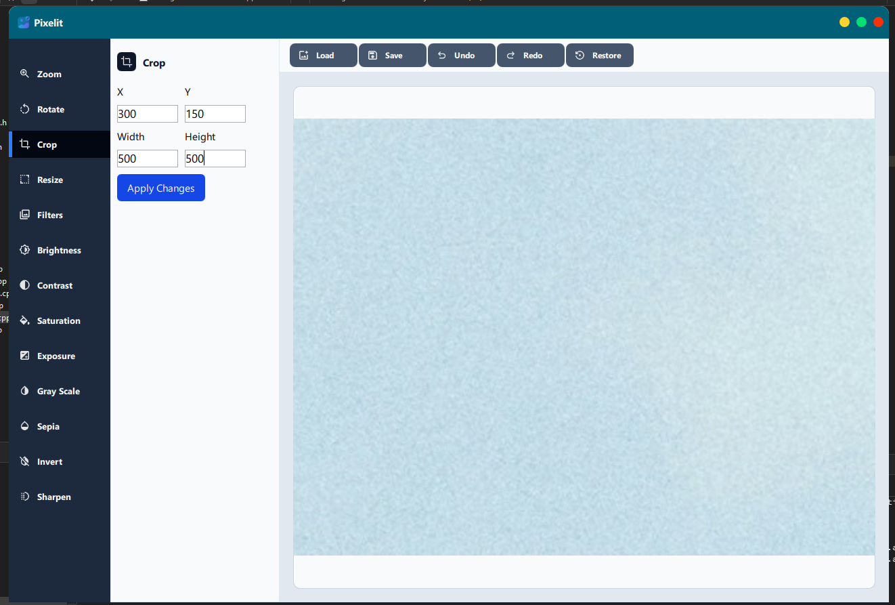
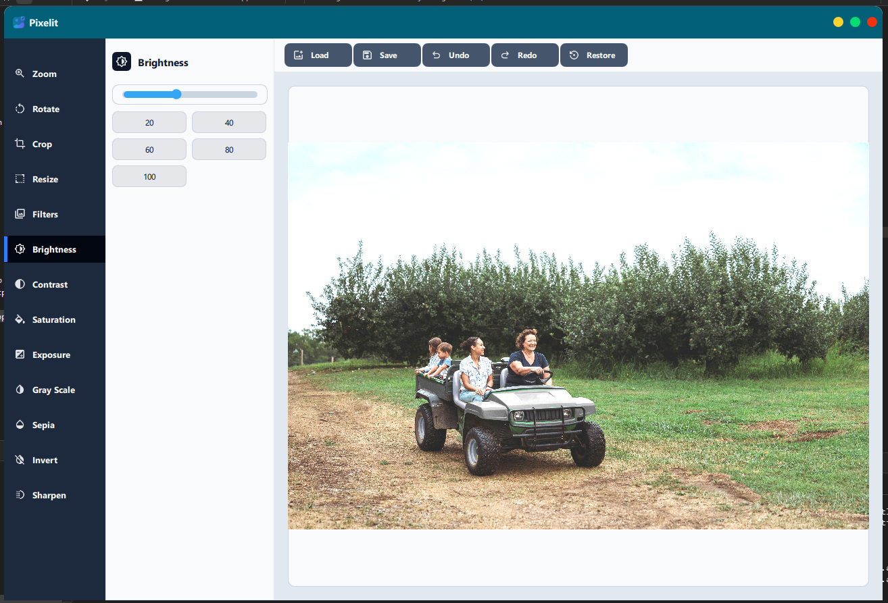
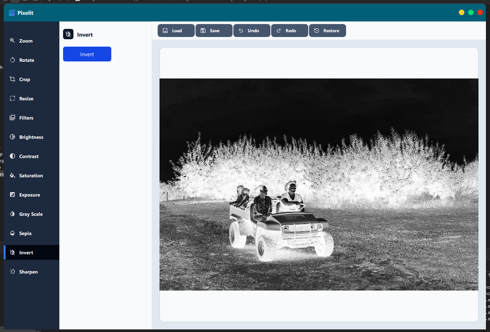

# PixelIt – Image Processing & Editing Application



PixelIt is a desktop image processing and editing application built with C++, Qt (QML + Qt Core), and OpenCV.
The project focuses on efficient image manipulation, real-time preview, and a clean, extensible architecture suitable for advanced computer vision and image processing workflows.

Pixelit is designed as a lightweight yet powerful image editor, showcasing strong fundamentals in image processing, UI-to-native integration, and performance-oriented C++ development.

## • Features
## • Image Processing & Editing

Load and process images using OpenCV

Real-time preview of applied transformations

Non-destructive editing pipeline (operations applied in sequence)


## • Transformations

Zoom (aspect-ratio preserved)
Pan
Rotate
Crop
Resize






## • Filters

Grayscale
Sepia
Gaussian Blur
Sharpen
Edge Detection

## • Image Adjustments

Brightness
Contrast
Saturation
Exposure
Invert Colors
Grayscale (adjustment mode)
Sepia (adjustment mode)
Sharpen (intensity-based)





## • Architecture Highlights

Clean separation between UI (QML) and image processing logic (C++ / OpenCV)
Modular filter and adjustment pipeline
Designed for easy extension (new filters or tools can be added without refactoring core logic)
Thread-safe image processing for smooth UI interaction

## • Technologies Used

C++ (C++17)
Qt 6
Qt Quick (QML)
Qt Core / GUI
OpenCV
CMake
QML Image Provider
Multithreading (std::thread)

## • Image Processing Techniques

Pixelit uses classic and efficient image processing techniques provided by OpenCV:

## • Filters & Effects

Color space conversions (BGR ↔ Gray)
Convolution-based filters (Gaussian Blur, Sharpen)
Edge detection (Sobel / Canny-based)
Pixel-level transformations (Invert, Sepia)

## • Adjustments

Linear and non-linear pixel intensity mapping
Contrast stretching
Brightness and exposure correction
Saturation manipulation in HSV color space

## • Setup & Development
##Prerequisites

Make sure you have the following installed:

Qt 6.x
Qt Quick
Qt Widgets
OpenCV
CMake ≥ 3.16
C++17 compatible compiler
MSVC / GCC / Clang

## • OpenCV Setup

Ensure OpenCV is correctly installed and accessible.
Example (Windows):

```bash
# Clone the repository
git clone https://github.com/Muhammedsuwaneh/pixelit-image-processor.git

# Navigate to the project folder
cd pixelit
```

In your CMakeLists.txt:

```bash
set(OpenCV_DIR "C:/opencv/build")
find_package(OpenCV REQUIRED)
```

Verify:
OpenCV core modules are detected
Image loading and processing work correctly

## • Build the Project

```bash
mkdir build
cd build
cmake ..
cmake --build .
```


Or open the project directly in Qt Creator and configure it with CMake.

## • Run the Application

After building:
Run from Qt Creator, or
Execute the generated binary from the build directory
Make sure:
Image files are accessible
Required OpenCV DLLs / shared libraries are in the runtime path

## • Version
1.0.0

## • Licensed
Under [`MIT`](LICENSE) - Copyright 2025/2026 